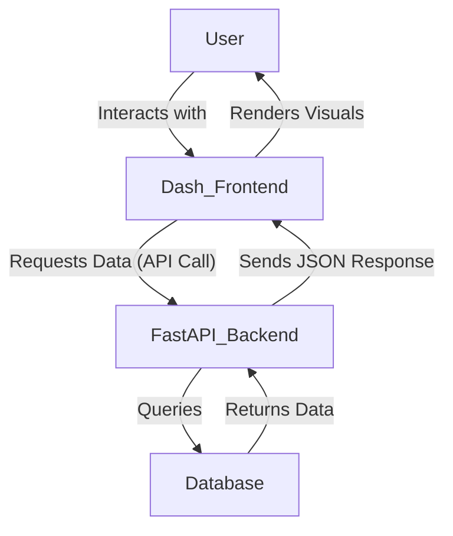
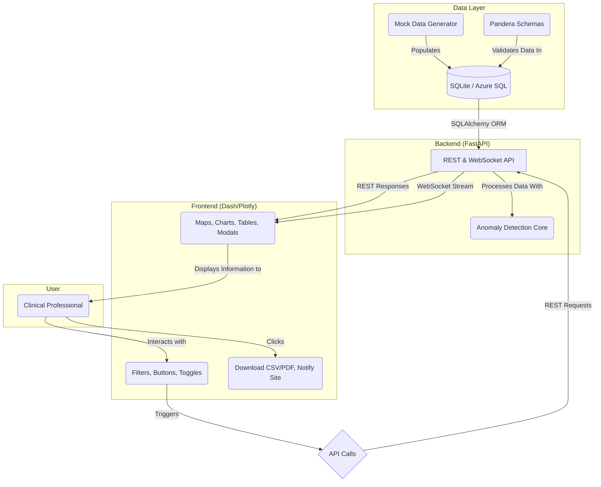

# dcriCTdash - DCRI Clinical Trial Oversight Dashboard

## Overview

This project is an interactive, web-based dashboard for DCRI professionals to monitor clinical trials in real-time. The main goals are to accelerate data review, automatically detect anomalies, and facilitate risk-based monitoring of trial sites.

### Core Features

* **Interactive Visualizations**: Includes an enrollment tracker, a site risk map, patient funnels (Sankey diagrams), and 3D scatter plots for lab data exploration.
* **Automated Anomaly Detection**: Flags issues like patient outliers or sites with systemic data problems.
* **Action-Oriented Tools**: Features a "Notify Site" function to act on insights directly from the dashboard.
* **Real-Time Demo Mode**: Uses WebSockets to stream mock data and show the dashboard updating in real-time.
* **Reporting**: Provides data export to CSV and summary reports in PDF format.

### Primary Users

The tool is designed for **Study Leads**, **Clinical Data Managers (CDMs)**, and **Study Coordinators**.

---

## Technical Snapshot

* **Programming Language**: The entire application is built using **Python**.
* **Architecture**: It uses a modern web architecture with a **FastAPI** backend to serve data via a REST API and WebSockets, and a **Plotly/Dash** frontend for the interactive user interface.
* **Database**: The primary data storage is a database, using **SQLite** for local development and designed for migration to a production database like **Azure SQL** via the **SQLAlchemy ORM**.

---

## Data Flow Diagrams

### Simplified Data Flow

This chart shows the primary interaction loop between the user, the frontend, the backend, and the database.



### Full Data Flow

This chart provides a more detailed view of the system's components and data pathways, including data validation, anomaly detection, and real-time streaming.



---

## Project Structure

The repository follows this structure to separate concerns between the API, dashboard components, and data logic.

```
/clinical-trial-dashboard/
|-- app/
|   |-- __init__.py
|   |-- main.py             # FastAPI app
|   |-- dashboard.py        # Dash app layout and callbacks
|   |-- components/         # Reusable Dash components
|   |-- core/               # Business logic, anomaly detection
|   |-- data/
|   |   |-- models.py       # SQLAlchemy ORM models
|   |   |-- schemas.py      # Pandera validation schemas
|   |   |-- generator.py    # Mock data generator
|   |   |-- database.py     # DB session management
|-- tests/
|-- .venv/
|-- pyproject.toml
|-- README.md
```

---

## Getting Started

1.  **Clone the repository:**
    ```bash
    git clone <repository-url>
    cd clinical-trial-dashboard
    ```
2.  **Create and activate a virtual environment:**
    ```bash
    python -m venv .venv
    source .venv/bin/activate  # On Windows: .venv\Scripts\activate
    ```
3.  **Install dependencies**:
    ```bash
    pip install -r requirements.txt # Or using poetry/pdm from pyproject.toml
    ```
4.  **Initialize the database and generate mock data:**
    ```bash
    python -m app.data.generator
    ```
5.  **Run the application:**
    The application is served using an ASGI server like Uvicorn.
    ```bash
    uvicorn app.main:app --reload
    ```
6.  **Access the dashboard** by navigating to `http://127.0.0.1:8000` in your web browser.

```
